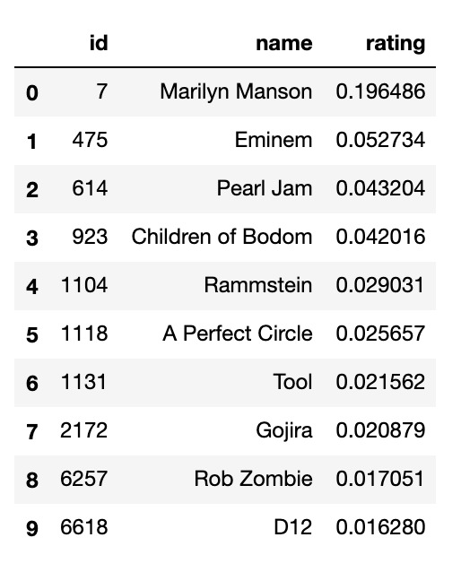
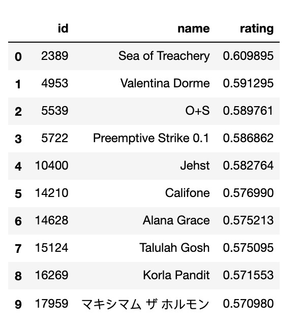
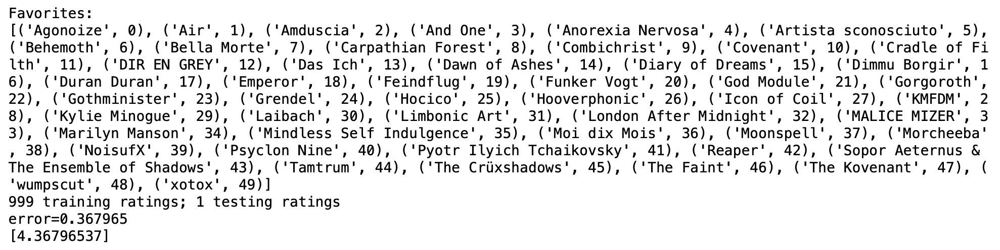

## Team Members

|Name|Niner ID|Email ID|
|---|---|---|
|Dhananjay Arora| 801077164| darora2@uncc.edu|
|Arjun Kalidas| 801078014| akalidas@uncc.edu|
|Naman Manocha| 801077765| nmanocha@uncc.edu|

## Introduction/Overview
A recommendation system is a program/system that tries to make a prediction based on users’ past behavior and preferences. Recommendation systems are typically seen in applications such as music listening, watching movies and e-commerce applications where users’ behavior can be modeled based on the history of purchases or consumption. We see them all around and it benefits a user in many ways because of its nature of prediction, value-add, and ease of consumption. A user wouldn’t have to spend hours to decide about a particular movie or music or a product. The relevant and useful content gets delivered to the user at appropriate times. Our aim is to build such a recommendation system using the existing tools and technologies, in addition to adding our own flavor to the data parallelization aspect by using Spark and Deep Learning libraries such as Google’s TensorFlow, Keras or Scikit-learn [2]. We hope to achieve similar performance, if not better than the researchers that have been working on such technologies.

## Context
We see an explosion of Music streaming apps these days and sometimes wonder or wrack our brains as to which one serves our purpose and how do we get the relevant set of songs when we open the application. We have many songs recommendation systems out there and those are being used by popular companies like Spotify, SoundCloud, Pandora, Amazon Music, etc. And most of them do predict music or movies based on our previous watching/listening history and feedback. Most of them work based on Collaborative and Content-based filtering which they call the “Hybrid” model [3]. The companies use advanced machine learning algorithms and data processing engines like Spark and Hadoop to produce the best results possible. While all these technologies exist, this is our take on the song recommendation systems and how we can contribute even though minuscule, to the already popular technology. We are aware that Machine learning algorithms like Neural Networks and Deep Learning are used in such complex systems. Along with these algorithms, we will leverage Alternating Least Squares in Spark [4] and execute the design on a distributed ecosystem like Hadoop, which is interesting.

## Objective
The goal is to implement the Content-based filtering whose underlying concept is TF-IDF vectorization and Cosine Similarity and Collaborative Filtering using Stochastic Gradient Descent to build a comprehensive recommender system for songs.

## Tasks involved
1. Literature Survey
2. Dataset collection
3. Data cleaning and pre-processing
4. Data visualization
5. Algorithm selection
6. Designing Recommender Architecture
7. Implementation of the algorithms
8. Quantitative analysis of the results

## Approach
Our approach was a unified content-based and collaborative filtering model that could improve the song recommendation system in general. We considered a Stochastic Gradient Descent (SGD) approach due to a couple of reasons, one of them being the case that Mean Squared Error (MSE) for SGD as compared to ALS is a huge difference. And SGD tends to beat ALS while sometimes ALS recommends better songs. Our hunch was that this could be due to SGD trying to overfit more than ALS and is more susceptible to popularity bias. Although we can't back that up with empirical evidence or math yet, even Netflix's paper about movie recommendation vouches for the same. While there is an option to combine both the model into one like an ensemble approach, we didn't take that. Another reason for choosing SGD being its ability to perform better in A/B tests. A/B tests are randomized experiments with two variants A and B. It is an application of statistical hypothesis testing used more in the field of statistics.

## Steps implemented
### Collaborative Based:
- For this approach we have read user_artists(userID, artistID, weight) and artists(id, name) files as data frame and merged them.
- We scaled the weight column imported from the user_artists file.
- We formed the compressed sparse row matrix with userId as our rows and artistId as our columns and each entry in matrix contain weight(renamed to playcount) which is the number of times each user plays songs corresponding to artistId. Further we filled each NaN value with 0.
- Splitting the data in test and train
- Defining Loss RMSE as our loss function.
- Calling Recommender class, which contains our main Stochastic Gradient Descent model taking epochs, latent_feature, lambda, learning_rate as input to it.
- Finally predicting the ratings in our test set.

### Content Based:
- We read ratings(userId, songId, rating, timestamp) and songs(songId, title, genre) file.
- we define 'featurize' method which is the main intuition behind the content based implementation, and takes songs file as input and added as feature named 'features'. Each row of our songs data frame contain a csr_matrix of shape (1, num_features).
- Each entry in csr matrix contain tf-idf value of the term. The 'featurize' method will return 2 items i.e songs dataframe and vocab which is a dictionary from term to int in sorted order.
- Randomly splitting our data
- Another method we define is 'cosine_similarity', which takes 2 input vectors of shape (1, number_features). This method is used to find the proximity between two csr_matrices.
- We define Mean Absolute Error as our loss function.
- And finally, our 'make_predictions' method returning one predicted rating for each element of ratings_test.

## Algorithms implemented
Stochastic Gradient Descent for collaborative filtering, TF-IDF vectorization and Cosine similarity for content-based filtering were implemented in Python. Since, our idea is to make use of large datasets as and when the data grows, and train the model to predict better, we had to look for a high efficiency parallel processing system. Apache Spark achieves high performance for both batch and streaming data, using a state-of-the-art DAG scheduler, a query optimizer, and a physical execution engine. This satisfied all our requirements and the concept of Resilient Distributed Datasets (RDD) introduced in this framework helped break down the data, analyze and churn out the results that we needed. A bottleneck in this regard was the learning curve for Scala or Pyspark. And naturally we selected Pyspark, but this was a major unknown and pushed us back few steps from our goal. The APIs used in Python 3.6 were largely different from the ones used in Pyspark and the way the dataframes are handled was nothing similar to Pandas dataframes. This stepback was one of the reasons why we weren't able to implement a Deep Learning model that took the outputs from Content and Collaborative filters to deliver accurate results. Although independently the content based and Collaborative filtering gives a very good precision our consensus is that probably Deep learning that uses Neural Networks would've improved that significantly. 

## Datasets
GroupLens[14] - HetRec 2011 - https://grouplens.org/datasets/hetrec-2011/
This dataset contains social networking, tagging, and music artist listening information from a set of 2K users from Last.fm online music system. http://www.last.fm 

Dataset files used are:
- artists.dat - This file contains information about music artists listened and tagged by the users.
- tags.dat - This file contains the set of tags available in the dataset.
- user_artists.dat - This file contains the artists listened by each user. It also provides a listening count for each [user, artist] pair.

This dataset was built by Ignacio Fernandez-Tobas with the collaboration of Ivan Cantador and Alejandro Bellogn, members of the Information Retrieval group at Universidad Autonoma de Madrid (http://ir.ii.uam.es)

Million Song Dataset [1] - http://static.echonest.com/millionsongsubset_full.tar.gz
Upon analysis of our dataset, we realized the magnitude was quite high to the ranks of millions. Since we cannot afford to run such a huge data and constrain the DSBA cluster or AWS, we are picking the smaller subset of 10,000 songs (1% of the entire dataset available from the source, 1.9GB). It contains "additional files" (SQLite databases) in the same format as those for the full set but referring only to the 10K song subset. Therefore, we can develop code on the subset, then port it to the full dataset.

## Final Result and Examples
## Collaborative Filtering
### Existing Ratings 

### Predicted Ratings

## Content-Based Filtering

## Performance Evaluation (quantitative)
  ### Interpretation of results:
  - The Root Mean Squared Error and Mean Absolute Error for Content Based Filtering is really good for a recommender system

|Metric | Value|
|---|---|
|Root Mean Squared Error|0.367965|
|Mean Absolute Error|4.36796|

  - Collaborative Filtering metrics are in the process of evaluation. We will be updating when we receive the metrics. The delay is due to the enormous dataset and the challenge with the computational resources. 

## Task Division

|S.No. | TASK | PERSON | TIMELINE |
|---|---|---|---|
|1|Literature Survey|All|28-31 Oct|
|2|Problem Identification and Dataset Collection|All|28-31 Oct|
|3|Data Cleaning and Preprocessing|Dhananjay and Naman|7 Nov|
|4|Content and collaborative filtering|Naman and Arjun|16 Nov|
|5|Data Parallelization using Spark|Arjun and Dhananjay|6 Dec|
|6|Prediction using Deep Learning(Future Work)|-|-|
|7|Experiments, Result Analysis, and Final Report|All|2 Dec|

## Tools/Technologies/Frameworks used
- Apache Spark 2.4.4
- Python 3.7
- Java 1.8
- Jupyter Notebook 6.0.0
- UNCC-DSBA cluster/ AWS EMR cluster
- Git for hosting the website

## Packages used
- SciPy
- scikit-learn

## Challenges
- It was challenging to understand the mathematical formulae, derivations and concepts behind content based and collaborative filtering.
- We had some confusion at one point regarding the latent features used in ALS algorithm.
- The learning curve to translate our understanding of TF-IDF vectorization and cosine similarity that are applied on bag of words to work for songs playlist was overwhelming, but we overcame it eventually.
- Enormous data sets that we use for song recommendation led us into a lot of performance related issues.
- Even the initial dataset we decided to implement this recommendation system had to be modified and additional datasets had to be merged to get all the required parameters.
- The understanding of the dataset and the relevant features were more time consuming than the actual implementation. Because lot of datasets had many features to offer, and we plotted various graphs such as correlation heat map, box plots (whisker plots) and histograms to reduce the dimensionality.

## Things learnt
- Implementation of collaborative filtering using Stochastic Gradient Descent algorithm.
- Implementation Content based filtering using cosine similarity and TF-IDF vector.
- The complexity and challenges of pre-processing huge datasets and modeling the data suitably.
- During our literature survey, we learned different approaches to implement recommender systems.
- This project gave us a clear understanding of how to select datasets, what to look for in them and manipulate them to derive usable insights.

## Conclusion
Recommendation systems are very prevalent nowadays and can be seen playing in the background of most websites and apps we visit. Whether we are visiting an e-commerce website like Amazon, a travel website such as Expedia, entertainment apps like Netflix, YouTube and Spotify, recommendation systems are an inevitable aspect. The inevitability arises due to the need to stay more relevant in business, acquire more customers and deliver an absolutely fabulous customer experience. In our project, we describe and attempt at developing one such recommendation system. We took into account, the Collaborative filtering and Content-based filtering to better predict the user's behavior. In the development of this project, we sought to overcome the widely known problems and shortcomings of such a system. In addition, we achieved data parallelization using Spark where we could make use of the RDD data structure and efficiently model the output. Although, we haven't implemented the Deep learning module that takes in the output from the filters, we hope to pursue our goal and make it more extensible to be used by an e-commerce or entertainment business.

## References
[1] Paul Lamere, Million Song Dataset, Lab ROSA, Volume 137, 2011, http://millionsongdataset.com/pages/getting-dataset/

[2] F. Fessahaye et al., "T-RECSYS: A Novel Music Recommendation System Using Deep Learning,"2019 IEEE International Conference on Consumer Electronics (ICCE), Las Vegas, NV, USA, 2019, pp. 1-6. doi: 10.1109/ICCE.2019.8662028 https://ieeexplore.ieee.org/stamp/stamp.jsp?tp=&arnumber=8662028&isnumber=8661828

[3] Badr Ait Hammou, Ayoub Ait Lahcen, and Salma Mouline, “An effective distributed predictive model with Matrix factorization and random forest for Big Data recommendation systems”, Expert Systems with Applications, Volume 137, 2019, Pages 253-265, ISSN 0957-4174, https://doi.org/10.1016/j.eswa.2019.06.046

[4] Yazhong Feng, Yueting Zhuang, and Yunhe Pan, "Music information retrieval by detecting mood via computational media aesthetics," Proceedings IEEE/WIC International Conference on Web Intelligence(WI 2003), Halifax, NS, Canada, 2003, pp. 235-241. doi:10.1109/WI.2003.1241199, http://ieeexplore.ieee.org/stamp/stamp.jsp?tp=&arnumber=1241199&isnumber=27823

[5] Jack Vasylenko, Chitwan Kaudan, Anith Patel, Tyler Larsen, and William Wang, Spotify Million Playlists (RecSys 2018) Challenge Submission, https://github.com/vaslnk/Spotify-Song-Recommendation-ML

[6] Kevin Liao, Prototyping a Recommender System Step by Step Part 2: Alternating Least Square (ALS) Matrix Factorization in Collaborative Filtering, https://towardsdatascience.com/prototyping-a-recommender-system-step-by-step-part-2-alternating-least-square-als-matrix-4a76c58714a1

[7] Albert Au Yeung, Matrix Factorization: A Simple Tutorial and Implementation in Python, http://www.albertauyeung.com/post/python-matrix-factorization/

[8] Alberta Yeung, Matrix Factorization, https://nbviewer.jupyter.org/github/albertauyeung/matrix-factorization-in-python/blob/master/mf.ipynb

[9] Insight, Explicit Matrix Factorization: ALS, SGD, and All That Jazz, https://blog.insightdatascience.com/explicit-matrix-factorization-als-sgd-and-all-that-jazz-b00e4d9b21ea

[10] Shuvayan Das, Beginners Guide to learn about Content Based Recommender Engines, https://www.analyticsvidhya.com/blog/2015/08/beginners-guide-learn-content-based-recommender-systems/

[11] Ramzi Karam, Using Word2vec for Music Recommendations, Towards Data Science, https://towardsdatascience.com/using-word2vec-for-music-recommendations-bb9649ac2484

[12] Paul Thompson, Matrix-Factorization-ALS, https://github.com/mickeykedia/Matrix-Factorization-ALS/blob/master/ALS%20Python%20Implementation.py

[13] Charles Bochet, Get Started with PySpark and Jupyter Notebook in 3 Minutes, Discover Sicara, https://www.sicara.ai/blog/2017-05-02-get-started-pyspark-jupyter-notebook-3-minutes

[14]  GroupLens Dataset @inproceedings{Cantador:RecSys2011, author = {Cantador, Iv\'{a}n and Brusilovsky, Peter and Kuflik, Tsvi}, title = {2nd Workshop on Information Heterogeneity and Fusion in Recommender Systems (HetRec 2011)}, booktitle = {Proceedings of the 5th ACM conference on Recommender systems}, series = {RecSys 2011}, year = {2011}, location = {Chicago, IL, USA}, publisher = {ACM}, address = {New York, NY, USA}, keywords = {information heterogeneity, information integration, recommender systems},} 
